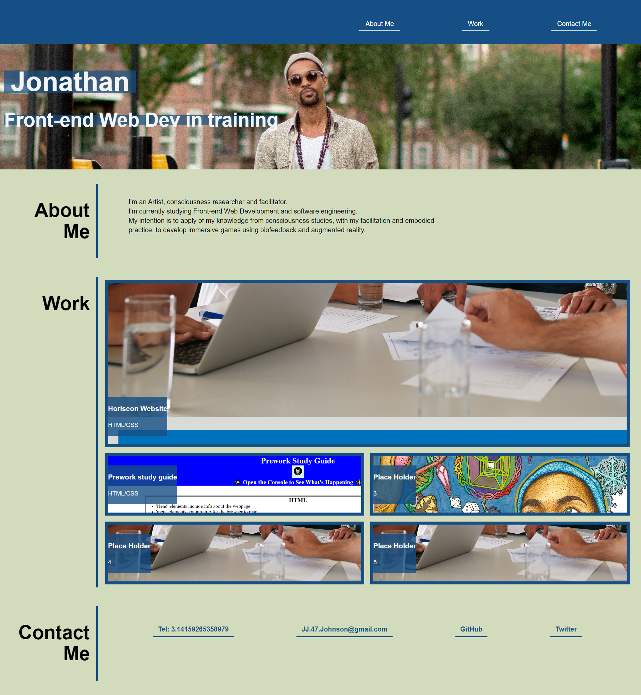
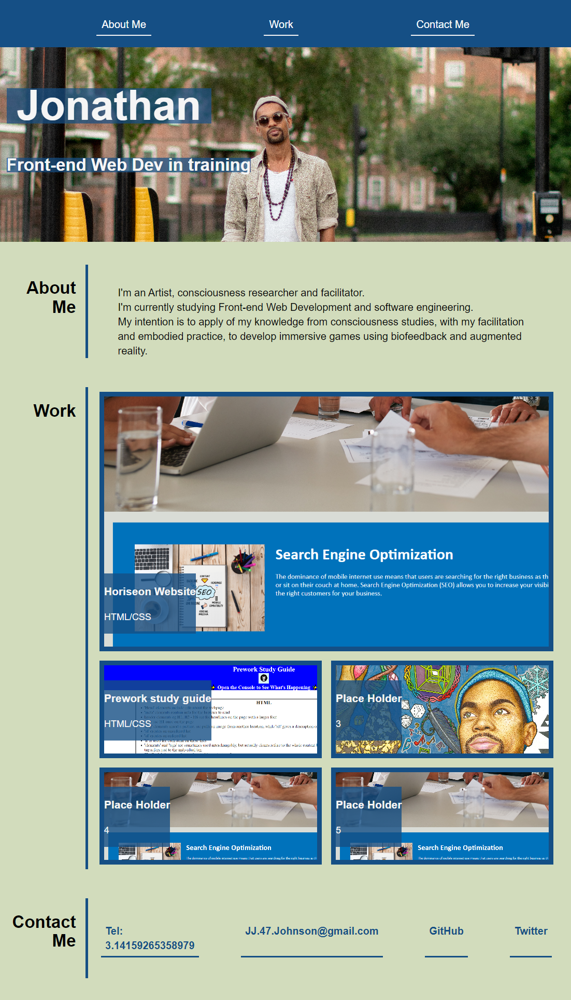
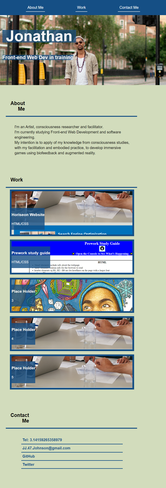

# JJ-Web-Developer-Portfolio
My first developer portfolio

### Code repository: 
https://github.com/Jakinlade/JJ-Web-Developer-Portfolio

### Deployed application: 
https://jakinlade.github.io/JJ-Web-Developer-Portfolio/

<br>

## Description

For this project, I was tasked with creating a portfolio web application using flex and grid skills learnt in the prior weeks lessons.

I created a simple application that resembled the example and is able to change size with different browser widths. I made 3 different screen size layouts using Media queries.

<br>

## Website Screenshots

### Large Screen: 980px - ~


### Medium Screen: 770px - 979px


### Small Screen: 0px - 769px


<br>

## Code Examples


- Made clear comments throughout my HTML and.
```html
  <header id="header">
    <!-- Nav Start -->
    <nav id="navBar">
          <a class="nav-item" href="#about">About Me</a>
          <a class="nav-item" href="#work">Work</a>
          <a class="nav-item" href="#contact">Contact Me</a>
    </nav>
    <!-- Nav End -->
  </header>
  <!-- Header End -->
  <main>

  <!-- hero Start -->
    <section id="hero-banner">
      <div class="container">
        <h1 class="hero-name"> Jonathan</h1>
        <h2 class="hero-subtitle">Front-end Web Dev in training</h2>
      </div>
    </section>
```

- Created Media queries for different screen size breakpoints.
```css
@media only screen and (min-width: 980px) {

    #navBar {
        justify-content: flex-end;
       
    }

    .about-content {
        max-width: 60%;
    }

}

@media only screen and (max-width: 769px) {
    #workGrid {
        flex-direction: column;
        
}
    .page-section {
        flex-direction: column;
        padding: 25px;
    }
    .section-title {
        display:flex;
        justify-content: left;
        border-right: none;
        padding-left: 20px;
    }
```
<br> 

## Technologies used


<br>

## License

MIT License

Copyright (c) 2022 Jonathan Johnson

Permission is hereby granted, free of charge, to any person obtaining a copy
of this software and associated documentation files (the "Software"), to deal
in the Software without restriction, including without limitation the rights
to use, copy, modify, merge, publish, distribute, sublicense, and/or sell
copies of the Software, and to permit persons to whom the Software is
furnished to do so, subject to the following conditions:

The above copyright notice and this permission notice shall be included in all
copies or substantial portions of the Software.

THE SOFTWARE IS PROVIDED "AS IS", WITHOUT WARRANTY OF ANY KIND, EXPRESS OR
IMPLIED, INCLUDING BUT NOT LIMITED TO THE WARRANTIES OF MERCHANTABILITY,
FITNESS FOR A PARTICULAR PURPOSE AND NONINFRINGEMENT. IN NO EVENT SHALL THE
AUTHORS OR COPYRIGHT HOLDERS BE LIABLE FOR ANY CLAIM, DAMAGES OR OTHER
LIABILITY, WHETHER IN AN ACTION OF CONTRACT, TORT OR OTHERWISE, ARISING FROM,
OUT OF OR IN CONNECTION WITH THE SOFTWARE OR THE USE OR OTHER DEALINGS IN THE
SOFTWARE.